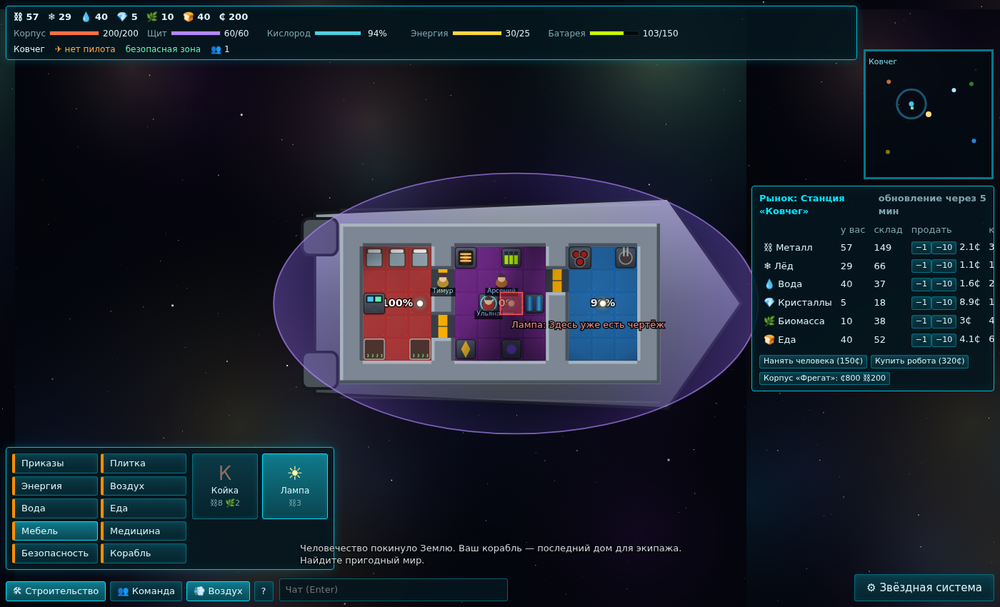

# NewStarforce

Перезапуск **STARFORCE.IO** (2017): «RimWorld в космосе», сразу многопользовательский.
Колония — это космический корабль: экипаж с потребностями, строительство по клеткам, комнаты с воздухом,
энергия, пожары, пробоины. Вокруг — звёздные системы, астероиды, планеты с биомами, враждебные машины и живая
флора, торговля и другие игроки в том же мире.



## Быстрый старт

Нужен Node.js 20+ (проверено на 22).

```bash
npm install
npm start            # собирает клиент и запускает сервер → http://localhost:8787
```

Друзья в той же сети открывают `http://<ваш-IP>:8787` — это общий мир. Мир сохраняется в `data/world.json`
каждые 30 секунд и при выключении (Ctrl+C). Вход привязан к токену в браузере: закрыли вкладку — корабль
«заморожен» и невидим, вернулись — он на месте.

Разработка с горячей перезагрузкой:

```bash
npm run dev          # сервер (tsx watch, :8787) + клиент (vite, :5173) → http://localhost:5173
npm test             # 40 тестов: механики корабля, мир, сеть, сохранение
npm run typecheck    # строгий TypeScript во всех трёх пакетах
```

Переменные окружения сервера: `PORT` (8787), `HOST`, `SAVE_PATH`, `SAVE_INTERVAL` (с), `SEED`.
Удалите `data/world.json`, чтобы начать мир заново.

## Управление

| Действие | Как |
|---|---|
| Лететь | ЛКМ по космосу (пилот сам садится за мостик; без пилота корабль стоит) |
| Выбрать объект | ЛКМ по планете / астероиду / врагу / кораблю → панель действий справа |
| Масштаб | Колесо. Отдалились — «Звёздная система», приблизились — интерьер |
| Корабль ⇄ система | Tab / Пробел / кнопка справа внизу |
| Строительство | B, выбрать категорию и постройку, ЛКМ (протяжка: пол — прямоугольником, стены — рамкой) |
| Команда | C: потребности, занятия, криосон, отметка для высадки 🚀 |
| Воздух по комнатам | O |
| Гиперпрыжок | G (в режиме системы) |
| Отмена | ПКМ / Esc. Shift+ЛКМ по модулю — вкл/выкл |

## Структура

```
packages/shared   симуляция мира (чистый TypeScript, без DOM и Node) + протокол
packages/server   Node + ws: авторитарный сервер, 10 тиков/с, сохранение, раздача клиента
packages/client   Vite + Canvas 2D: рендер и HTML-интерфейс
docs/             дизайн, архитектура, дорожная карта
AGENTS.md         правила и план работ для ИИ-ассистентов (Cursor, Claude Code)
```

Подробно: [docs/GDD.md](docs/GDD.md) · [docs/ARCHITECTURE.md](docs/ARCHITECTURE.md) · [docs/ROADMAP.md](docs/ROADMAP.md)

## Свой арт

Положите `packages/client/public/sprites/<тип_модуля>.png` (например `reactor.png`, 64×64) — игра возьмёт
спрайт вместо процедурной отрисовки. Список типов — в `packages/client/public/sprites/README.md`.
